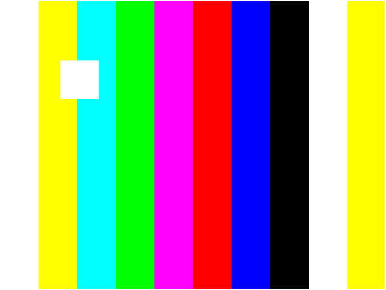

# vga-640x480

FPGA で VGA（640×480 / 60Hz）映像を出力する入門用サンプル。
カラーバーの背景に、白い箱が画面内をバウンドするテストパターンを表示します。



## ディレクトリ構成

```
vga-640x480/
├── rtl/                 # 合成対象のVerilog（実機に書き込む側）
│   ├── vga_640x480.v    #   タイミング生成の土台（x,y,visible,hsync,vsync）
│   ├── draw_test.v      #   描画（x,yから色を決める。ここを書き換えて遊ぶ）
│   ├── top.v            #   シミュレーション用の配線（pix_clk=clk_in）
│   └── top_basys3.v     #   Basys3実機用トップ（100→25MHz分周・4bit色）
├── sim/
│   └── tb_vga_test.v    # シミュレーション用テストベンチ（PCで絵を確認）
├── constraints/
│   └── Basys3_VGA.xdc   # Basys3 のピン割り当て（制約ファイル）
├── docs/                # プレビュー画像
├── Makefile             # iverilogでのビルド/実行
└── .gitignore
```

## 仕組みのざっくり説明

```
clk → [vga_640x480] →(x,y,visible,hsync,vsync)→ [draw_test] →(r,g,b)→ ピン → VGA
```

- `vga_640x480.v` … クロックを数えて「今どこを描いているか(x,y)」を作る土台。基本いじらない。
- `draw_test.v` … 受け取った座標から色を決める主役。**ここを書き換えると絵が変わる。**
- `top.v` … 上2つを部品として置いて配線する。

詳しい解説は Obsidian の `FPGA/VGA映像出力_コード解説.md` を参照。

## シミュレーション（実機なしで絵を確認）

[Icarus Verilog](http://iverilog.icarus.com/) が必要です。

```sh
make        # rtl/ と sim/ をコンパイルして実行 → frame.ppm を生成
make png    # frame.ppm を frame.png に変換（要 ImageMagick）
make clean  # 生成物を削除
```

`frame.ppm` / `frame.png` を画像ビューアで開くと、映るはずの絵が確認できます。

## 実機で動かす（Basys3 / Vivado）

Basys3 はVGAコネクタが基板に内蔵で、各色4bitの抵抗DACも基板側にある。
**自作DACは不要**で、FPGAピンをそのままコネクタにつなぐ配線になっている。

Vivado での手順:

1. `rtl/*.v`（特に `top_basys3.v`）と `constraints/Basys3_VGA.xdc` をプロジェクトに追加。
2. **top モジュールを `top_basys3` に設定**（`top.v` はシミュレーション専用なので合成には使わない）。
3. Generate Bitstream → Basys3 へ書き込み → VGAケーブルでモニタへ。

`top_basys3.v` がやっていること:

- 基板の **100MHz を ÷4 して 25MHz** のピクセルクロックを生成（簡易版）。
  より厳密には Clocking Wizard(MMCM) で 25.175MHz を作るのがおすすめ。
- `draw_test` の **2bit色を4bitへ拡張**（`{r,r}` 等）して基板の4bit DACへ。

別ボード（Tang Nano/iCE40 など）に移す場合は、`top_basys3.v` 相当のトップと
そのボード用の制約ファイル（`.cst` / `.pcf`）を用意すればよい
（`vga_640x480.v` と `draw_test.v` はボード非依存でそのまま使える）。

## ライセンス

MIT（必要に応じて変更してください）。
